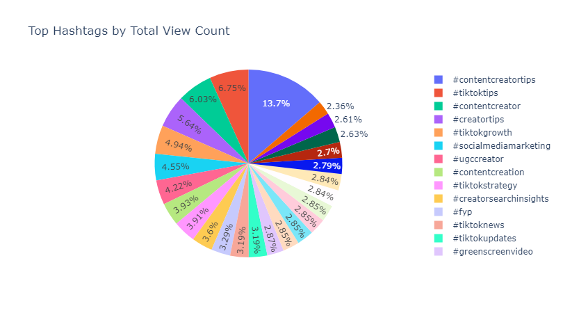
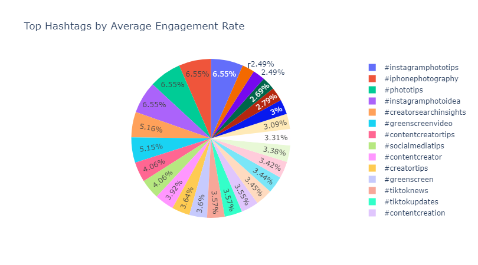
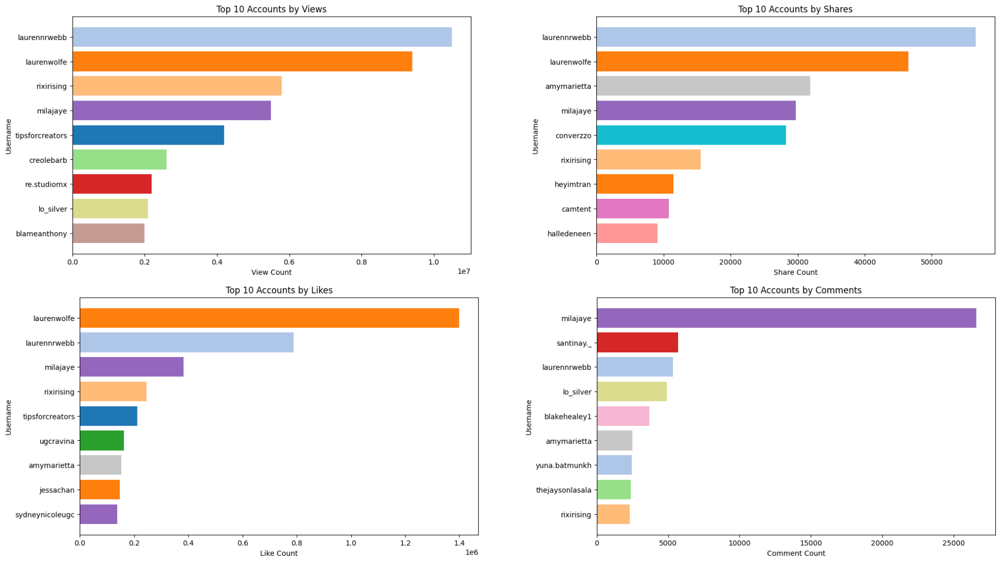
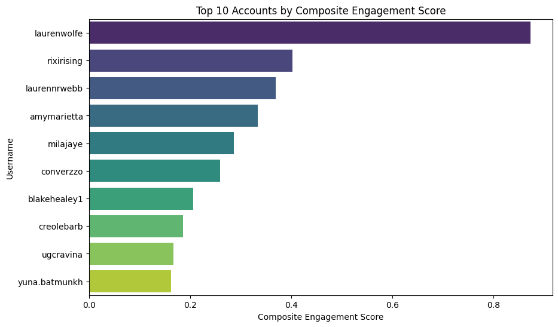
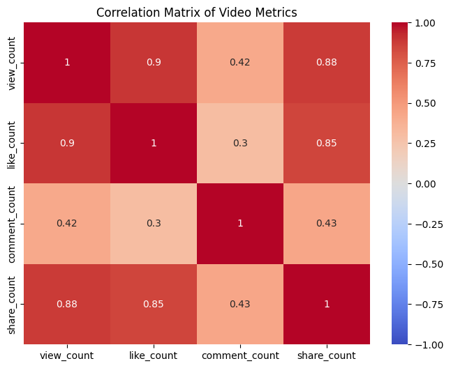
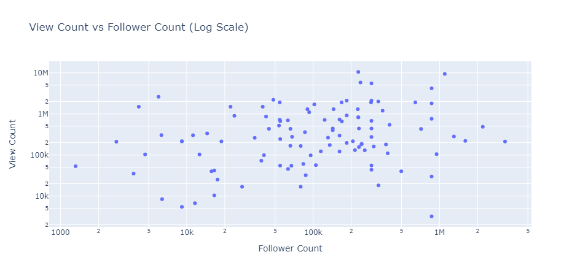
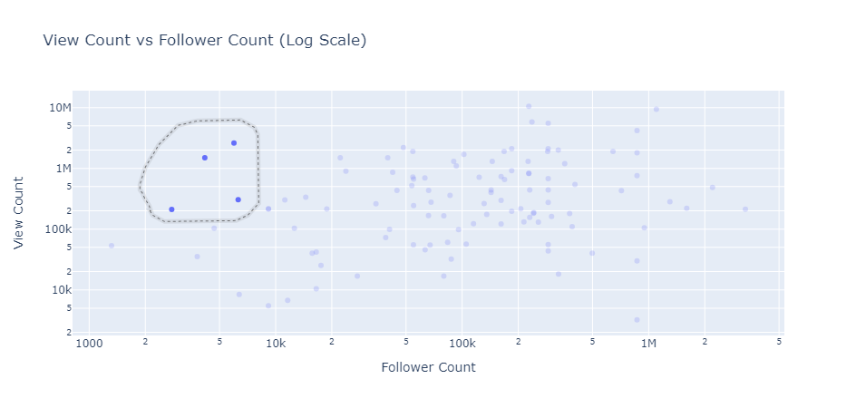

## Business Problem
___
If I had to start all over again with my career, I would have started building a social media audience from the beginning. 

In "Day Trading Attention," Gary Vaynerchuk explains that attention is one of the most valuable assets to modern businesses (this extends to personal brands, hence, my interest). His thesis is that one of the highest Return on Investment (ROI) ways to capture that attention is to use organic social media and to make content that people want to consume. 

But, as a late comer to social media, it is unclear what the average person wants to watch. By extension, it may not be clear to a business what kind of content they should be creating and how to position that content if they haven't created any up to the present day.

Therefore, we can set up a couple of questions:
1. How are creators in our niche currently getting their content in front of the right people organically? More specifically, what hashtags are they using to help communicate their target audience to the platform's algorithm?
2. Who are the current top performers in our niche in terms of views and engagement? 
3. Assuming we are starting from scratch, can we identify some creators in our niche that have low follower counts but have high views and engagement? This could inform a strategy for scaling quickly.

In this project, we will focus on TikTok due to a couple of features of the platform:
- Interest based algorithm, which allows new accounts with low followers to get a relatively high view rate IF they have content that aligns with the target audience's interests.
- Industry leading short form video format.

### Data Source
___
Data has been scraped from a search completed on TikTok's website. A semi-manual technique that is compatible with TikTok's Terms & Conditions has been used.

Briefly, this technique is as follows:
1. Sign in to TikTok's website through a desktop browser.
2. Complete a search term related to the niche of the business that we are strategizing for. In this case, we will use "Organic Marketing" as the search term. 
3. Open developer tools in the browser. Refresh the page and open the Network tab. Search "full/" 
4. Scroll through the search results to collect more responses for video search results.
5. Save the JSON files that have been collected as a HAR file. 

This HAR file will be used as the initial raw data source.

The search term used in this case is "Content Creator Tips." This is because of my personal interest and immediate value of the data to these interests. A data driven approach could provide a different perspective than most creators in this space, currently.

### Methods and Tech Used
___
- Data was gathered using web scraping tools and stored in a structured format for analysis.
- A Jupyter Notebook, along with Python libraries such as Pandas, was used for data cleaning, aggregation, and normalization.
- Matplotlib, Plotly, and Seaborn were employed to create visualizations, including bar charts, pie charts, scatter plots, and correlation matrices.
- MinMaxScaler was applied for normalizing metrics, and a custom composite engagement score was calculated by weighting various engagement metrics.

### Results
___
*1. How are creators in our niche currently getting their content in front of the right people organically? More specifically, what hashtags are they using to help communicate their target audience to the platform's algorithm?*

The 'Top Hashtags by Total View Count' pie chart reveals the hashtags associated with the most views for the search query 'Content Creator Tips.' Unsurprisingly, #contentcreatortips is the top result, probably due to how TikTok calculates their Search Engine Optimization (SEO). But, it is worth noting that the rest of the 24 hashtags offer some other ideas of how one might use hashtags to get in front of an audience interested in content creator tips. **Some other tangential customer segments may also be identified. Such as UGC creators, people interested in social media marketing, or people interested in TikTok news.**

An interesting insight can be gained from the second pie chart, 'Top Hashtags by Average Engagement Rate.' The posts with the highest engagement are associated with more actionable and specific hashtags. Accounts can get a lot more interaction with the audience by talking about photography tips, and tools to create content such as the Creator Search Insights tool and the Greenscreen effect used in the content creation part of the app. **New accounts could use this information to form a stronger relationship with the audience in the early stages of entering a niche.**

*2. Who are the current top performers in our niche in terms of views and engagement?*

When observing the bar charts for the top 10 accounts for each metric, there is not a clear winner or set of accounts that are leaders. So, it was necessary to create a composite scoring function that incorporated normalized data from the metrics we are observing. 

The process of calculating the composite engagement score involves two steps: First, we aggregate the metrics (views, likes, comments, shares) for each user by calculating their average per video. 
Then, we normalize these aggregated metrics using Minimum-Maximum scaling and calculate the composite engagement score by applying custom weights to each normalized metric (views, likes, comments, and shares), combining them into a final score for ranking.

From this data, we can see that **the top performing accounts in this niche**. Further investigation of their videos are necessary to determine the differentiating factors. Variables such as their delivery of their content (tone, cadence, non-verbal communication), the hook that they use (the first 3-5 seconds of the video), and reposting networks should be considered, among other variables.

Observing the bar charts of the top 10 accounts above, one of the charts stands out as very different; The Top 10 accounts for comments does not contain many of the top performers from the other charts. This seems to indicate that comments perform differently in the algorithm that determines virality of a video. So, a Correlation Matrix (above) was created to evaluate this. It seems that **comment count does not correlate strongly with other metrics**. Further investigation is necessary to determine if this is due to outlier videos - videos with a very high or low number of comments. Or, potentially this may be a novel observation.

*3. Assuming we are starting from scratch, can we identify some creators in our niche that have low follower counts but have high views and engagement? This could inform a strategy for scaling quickly.*

The scatter plot uses a logarithmic scale to chart view count vs. follower count. The user can highlight the dots in the plot generated in the jupyter notebook to identify the account and it's X and Y values. 
**For a new account, a tool like this can be used to identify accounts that have performed well with a relatively low follower count.**

For example, the accounts contained in the circle above have under 10k followers, but over 200k views on the video that appears in this search query. Investigating this video, and the account may indicate variables that could be used to mimic this virality.

### Limitations 
___
- The search results can be influenced by the user account used to complete the search during the data gathering phase. 
	- Previous engagement with specific hashtags and accounts may alter the results that are returned.
	- The location of the device used to complete the search alters results. 
- On the desktop website, results can not be filtered by date. Therefore, videos that benefited from trends and first mover advantage can skew the applicability of insights gained.
- The results of this search are just a snapshot. For time series analysis, one would have to create multiple HAR files and store the data for an extended period of time. 